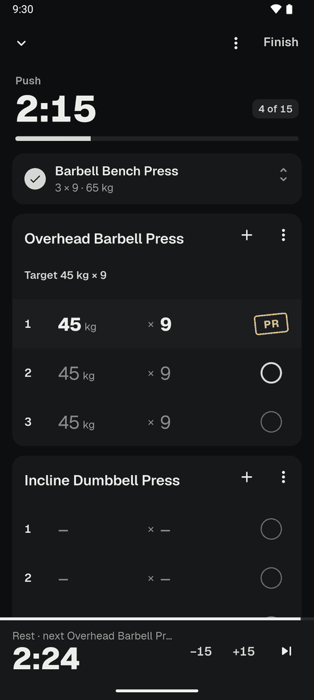
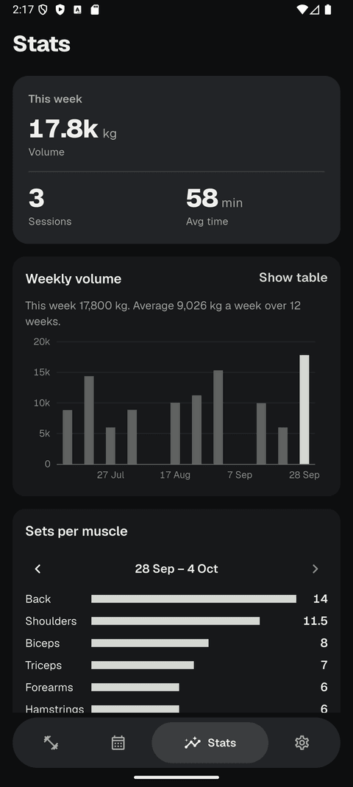
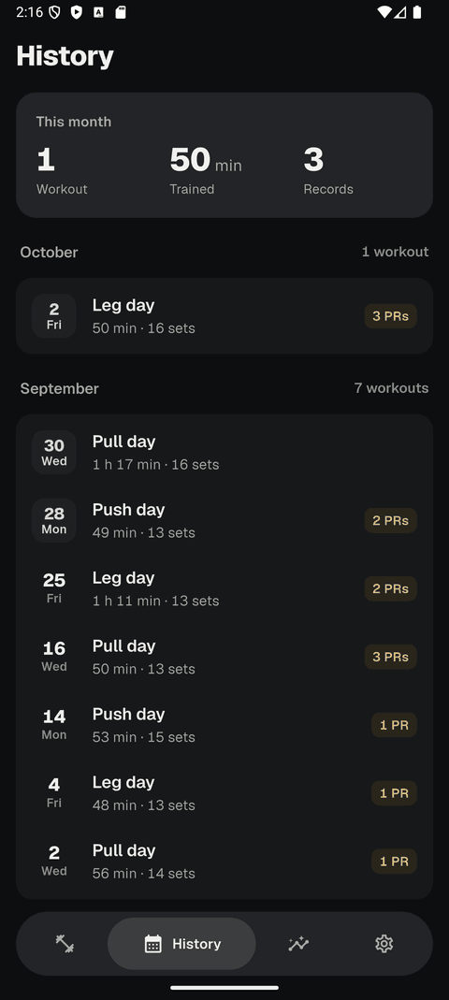
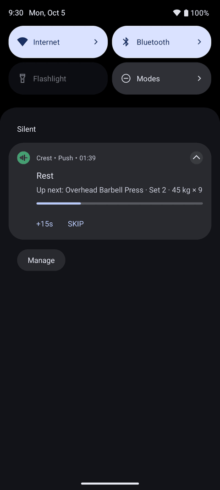

# Crest

**A fast, quiet gym log. Tap a set, rest, lift.**

A workout tracker for Android that works with no signal. Your data stays on your phone.

[**Download the APK**](../../releases/latest) · [Case study](https://appliedtheory.vercel.app/work/crest) · [Privacy](https://adrieltte.github.io/crest-privacy/)

 

## What it does

- **Log sets in a couple of taps**, from a template or an empty session.
- **Rest timer** that keeps running with the screen off, with a live notification you can check without opening the app.
- **History and personal records**, plus charts of weekly volume and sets per muscle.
- **Plate loading** helper so you know what to put on the bar.
- **Backup and restore** to Google Drive or a folder, only if you turn it on.
- No ads, no account, no tracking.

## Install

1. On your phone, open the [latest release](../../releases/latest) and download the `.apk`.
2. Open it. Android asks you to allow installs from your browser or file manager. Allow it for this one install.
3. Tap Install.

Each release lists a SHA-256 checksum if you want to verify the download.

Updates

Install a newer APK over the old one. Your workouts and settings stay. Builds are signed with the same key every time, so updates install cleanly.

[Obtainium](https://github.com/ImranR98/Obtainium) can watch this repo and tell you when a new version is out. Choose Add App and paste this repo's address.

If you installed Crest from Google Play, delete that copy first. The two are signed with different keys and will not update each other.

## Privacy

Crest collects nothing. Your data stays on your device unless you turn on Google Drive or folder backup yourself. Read the [privacy policy](https://adrieltte.github.io/crest-privacy/).

## Feedback

Found a bug or want something added? [Open an issue](../../issues).

Built by [Adriel Tang](https://appliedtheory.vercel.app/) with Flutter.
